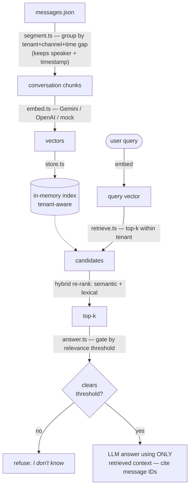

# Conversation RAG — Learning Project (TypeScript)

A small dependency-light RAG pipeline over community
chat conversations, built to learn a
community-intelligence product: answer questions from a community's history,
grounded and cited, without hallucinating, and without leaking across tenants.

## Pipeline



## Quickstart

```bash
npm install

# 1) Build the index from data/sample_conversations.json
npm run ingest

# 2) Ask a question (scoped to one community / tenant)
npm run query -- --tenant acme-gaming "When is the tournament and is it free?"
npm run query -- --tenant acme-gaming "What is the refund policy?"   # -> refuses
npm run query -- --tenant devtools-hub "When is the tournament?"     # -> refuses (cross-tenant)

# 3) Evaluate retrieval + refusal on the labeled golden set
npm run eval
```

No key → MOCK mode. Force it with
`RAG_MOCK=1`. For a real provider (Gemini shown; set `OPENAI_API_KEY` instead to
use OpenAI):

## How it avoids hallucinating

The pipeline does not trust the model to admit when it doesn't know. Instead it
decides in code, using the retrieval score.

Every retrieved chunk has a cosine similarity score (see [store.ts](./src/store.ts)). If the best chunk scores
below `RETRIEVAL_MIN_SCORE`, the model is never called — we just return
"I don't know". If it clears the bar, only the chunks above the bar are passed
to the model, with a prompt that says: use only this context, cite the message
IDs, never guess.

## Development

```bash
npm run typecheck   # tsc --noEmit (strict)
npm test            # vitest
npm run lint        # eslint
npm run format      # prettier
```
